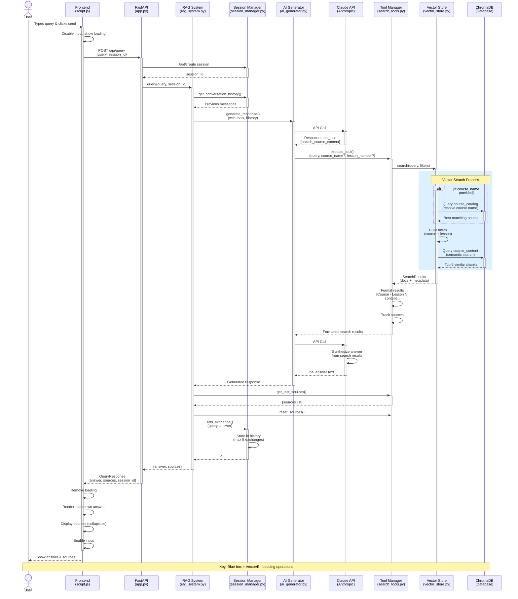

# RAG Chatbot Query Flow Diagram



## Component Responsibilities

### Frontend Layer
- **script.js**: User interaction, API calls, UI updates
- **index.html**: UI structure, input/output display

### API Layer
- **app.py**: FastAPI endpoints, request/response handling
- **Session Manager**: Conversation history tracking (max 5 exchanges)

### RAG Core
- **RAG System**: Main orchestrator, coordinates all components
- **AI Generator**: Claude API interaction, tool execution loop

### Search Layer
- **Tool Manager**: Tool registration and execution
- **Course Search Tool**: Search interface, result formatting
- **Vector Store**: Dual collections (catalog + content)
- **ChromaDB**: Persistent vector storage with embeddings

## Key Features

1. **Agentic RAG**: Claude decides when to search (not always)
2. **Two-Step Search**:
   - Course catalog (fuzzy name matching)
   - Content search (semantic + filters)
3. **Tool Calling**: Claude API native tool use
4. **Session Context**: Multi-turn conversations with history
5. **Source Tracking**: Separate sources for UI display

## Data Flow

```
Query Text
    ↓
[Sentence Transformer Embedding]
    ↓
[ChromaDB Similarity Search]
    ↓
Retrieved Content Chunks
    ↓
[Claude Synthesis]
    ↓
Natural Language Answer
```
